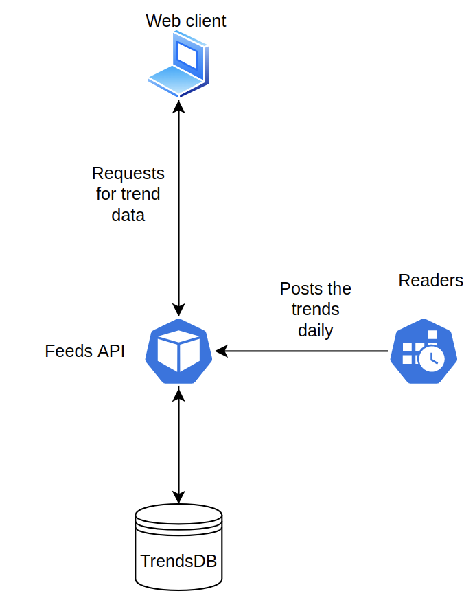

# daily-trends
Daily trends app

## System architecture

### Readers
The reader is the service in charge to read the several webs and request the Feeds API for posting new feeds to the database. This service will be running in a Kubernetes CronJob that will configure the periodicity of the reads and posts.

### Feeds API 
This is the service in charge to manage the access to the feeds database. This database can only be accesed through the Feeds API.

### Web client 
This element of the architecture gives the user an UI to read, create, update and delete feeds of the database.

